# Скриншоты выполнения задания Airbnb #74

## Задание

Вывести идентификатор и признак наличия интернета в помещении. Если интернет есть — «YES», иначе «NO».

## Как воспроизвести результат

### 1. Подготовка БД

Для задания #74 достаточно таблицы комнат:

- `rooms.sql` — создание и заполнение таблицы rooms

При необходимости полной схемы: по очереди выполните `rooms.sql`, `users.sql`, `reservations.sql`, `reviews.sql`.

### 2. Запрос (solution.sql)

```sql
SELECT
    id,
    CASE WHEN has_internet THEN 'YES' ELSE 'NO' END AS has_internet
FROM rooms
ORDER BY id;
```

### 3. Выполнение (SQLite)

```bash
cd 7_sql_airbnb
sqlite3 airbnb.db ".read rooms.sql"
sqlite3 -header -column airbnb.db ".read solution.sql"
```

### 4. Результат выполнения

| id | has_internet |
|----|--------------|
| 1  | YES          |
| 2  | YES          |
| 3  | NO           |
| 4  | NO           |
| 5  | YES          |
| 6  | YES          |
| 7  | NO           |
| …  | …            |
| 50 | NO           |

Всего 50 комнат; для каждой выведены id и признак has_internet (YES/NO).

### 5. Скриншоты решений (папка images/)

Скриншоты выполнения каждого задания лежат в папке **images/** и подключены ниже.

| № | Задание | Скриншот |
|---|---------|----------|
| 58 | INSERT отзыва (рейтинг 5) от George Clooney | 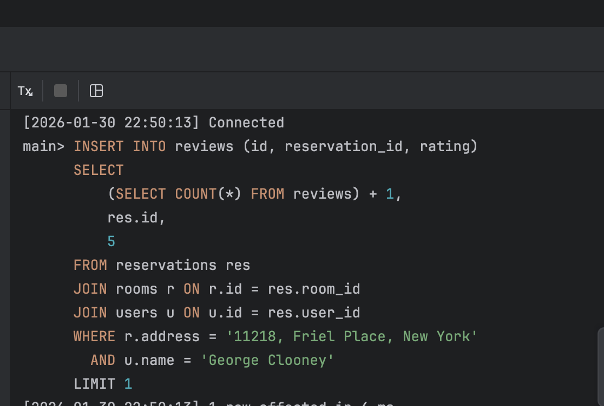 |
| 59 | Пользователи с белорусским номером (+375) | 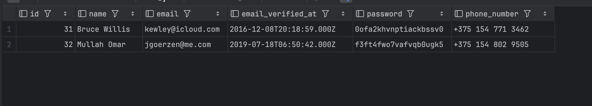 |
| 61 | Комнаты в 12-ю неделю 2020 | 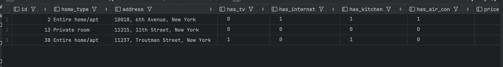 |
| 62 | Домены 2-го уровня из email | 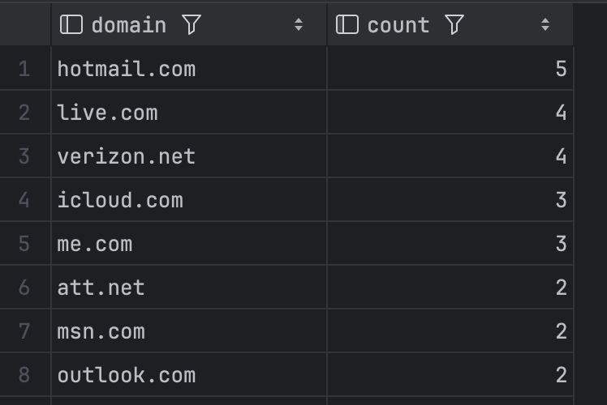 |
| 64 | Бронирования по году и месяцу | 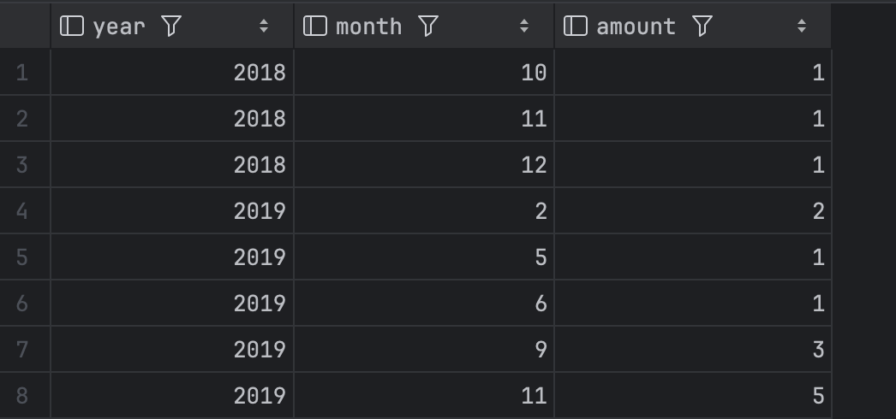 |
| 65 | Рейтинг комнат (FLOOR AVG отзывов) | 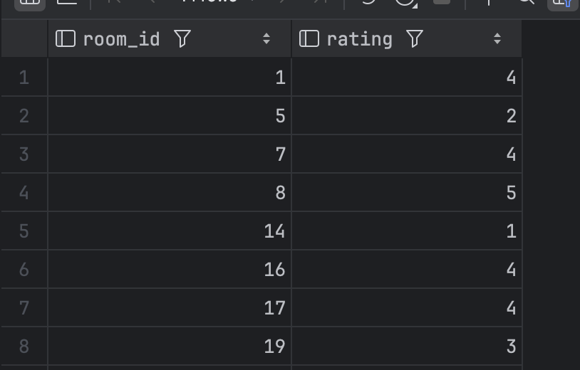 |
| 66 | Комнаты со всеми удобствами + дни и сумма | 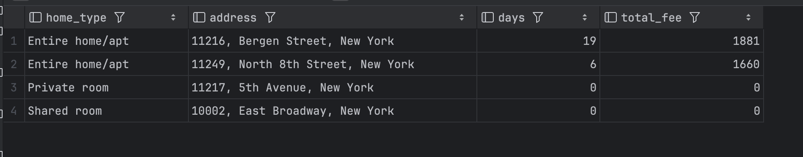 |
| 68 | Последний арендатор и дата выезда | 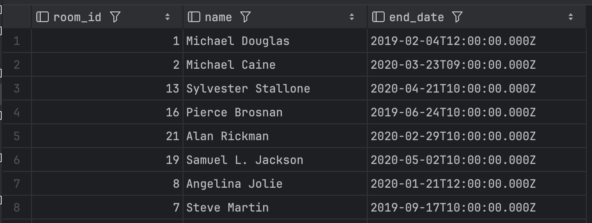 |
| 69 | Владельцы и сумма заработка | 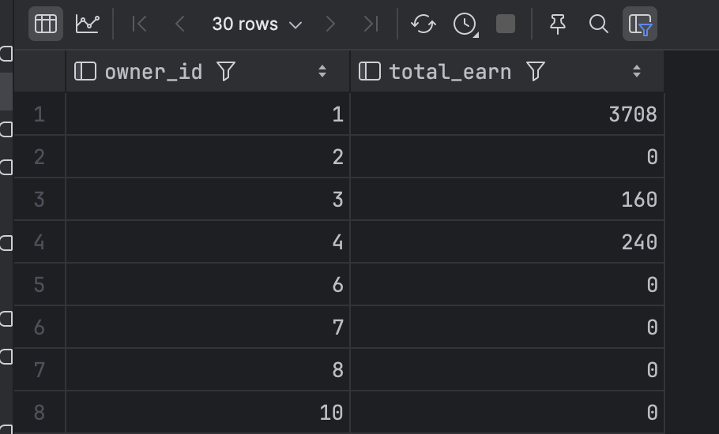 |
| 70 | Категории жилья (economy/comfort/premium) | 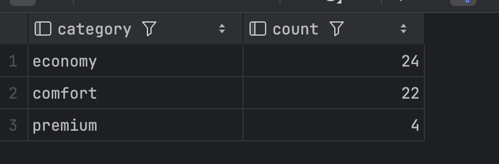 |
| 71 | Процент активных пользователей | 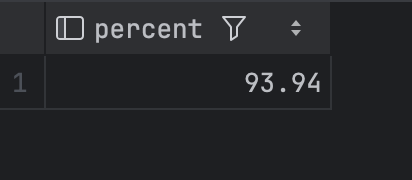 |
| 72 | Средняя цена за сутки по комнатам | 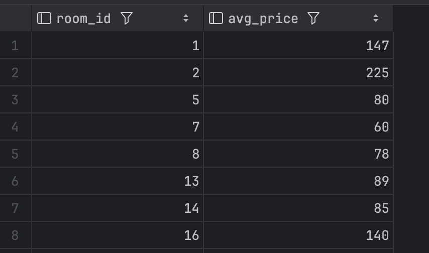 |
| 73 | Комнаты с нечётным числом бронирований | 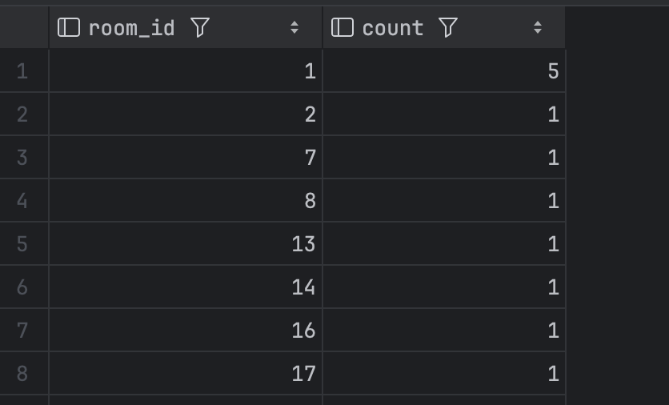 |
| 74 | id и признак интернета (YES/NO) | 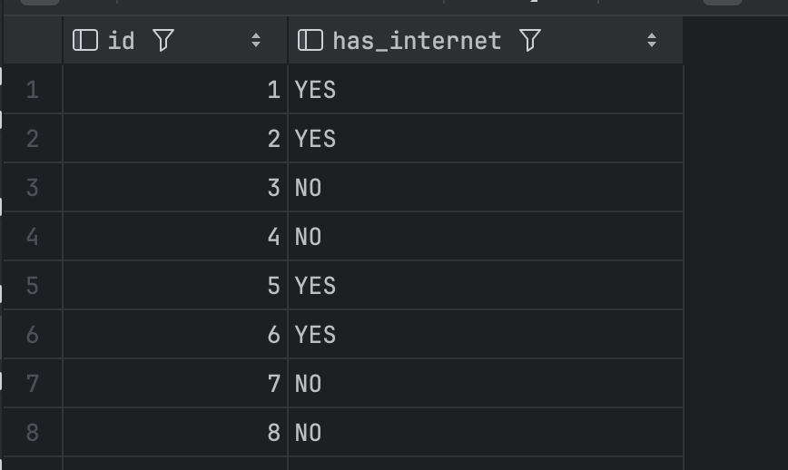 |
| 76 | Пользователи + is_owner, is_tenant | 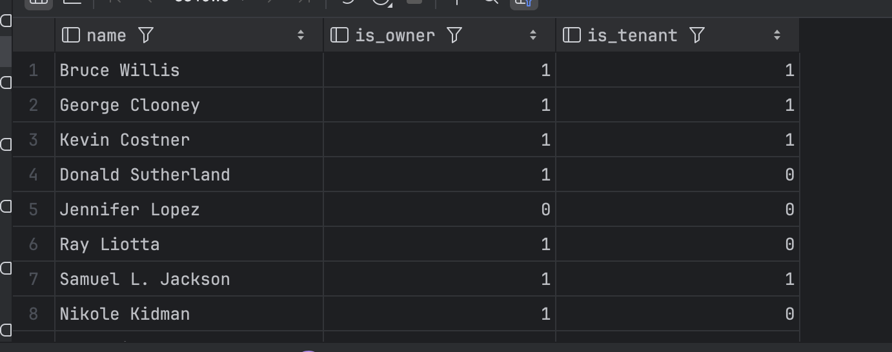 |
| 78 | Пользователи с hotmail.com | 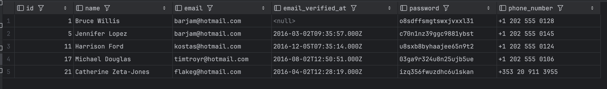 |
| 79 | id, home_type, price (скидка 10%) | 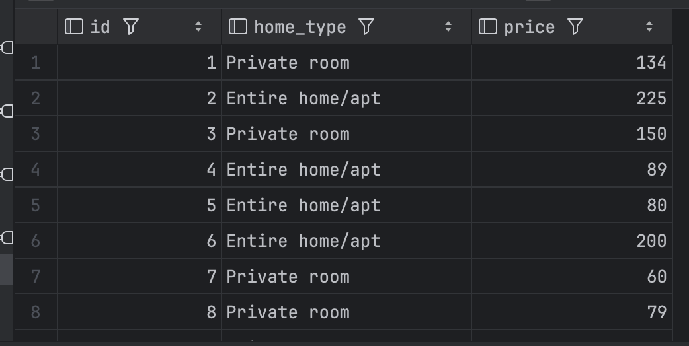 |
| 80 | Представление Verified_Users | 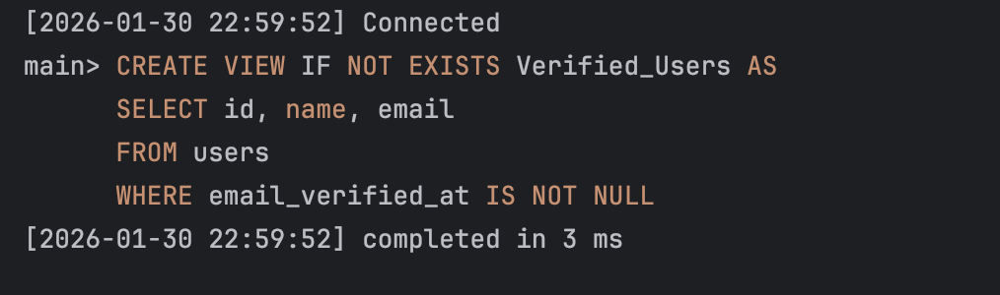 |

