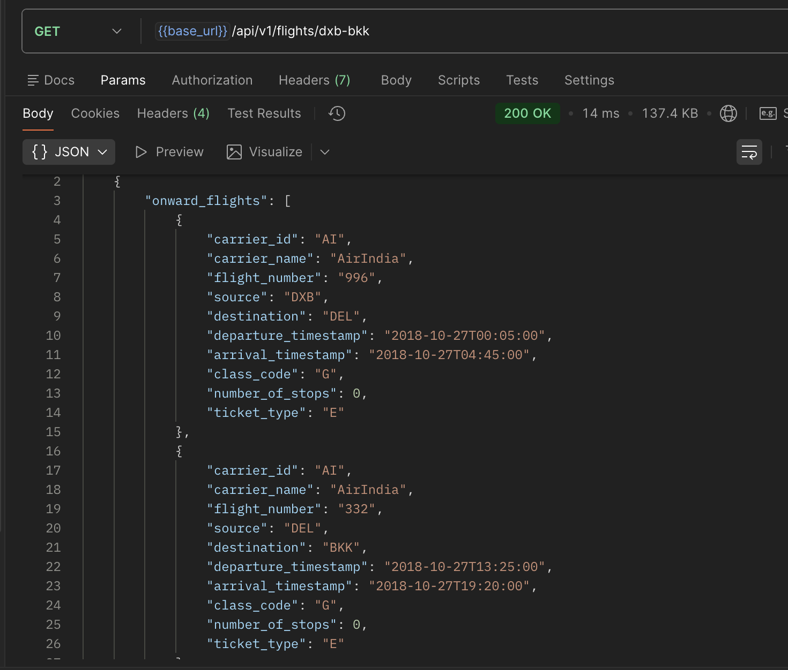
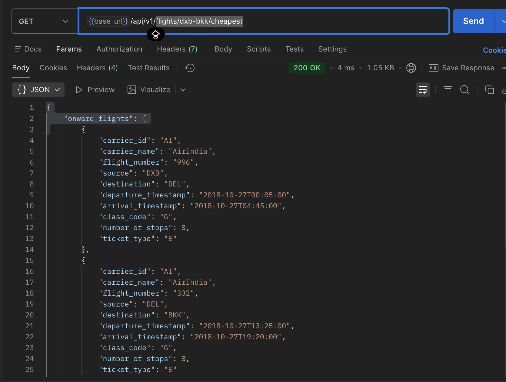
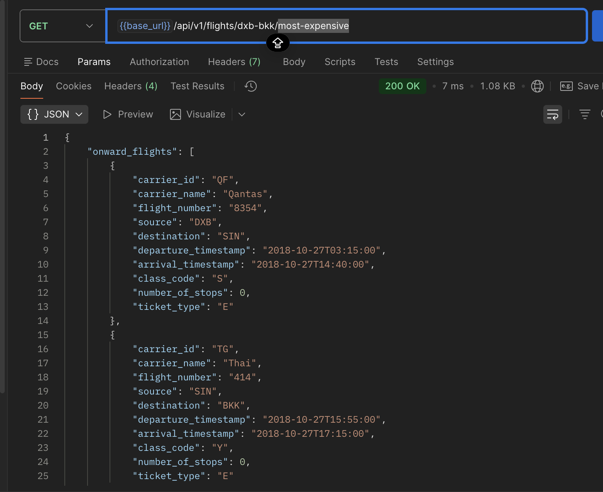
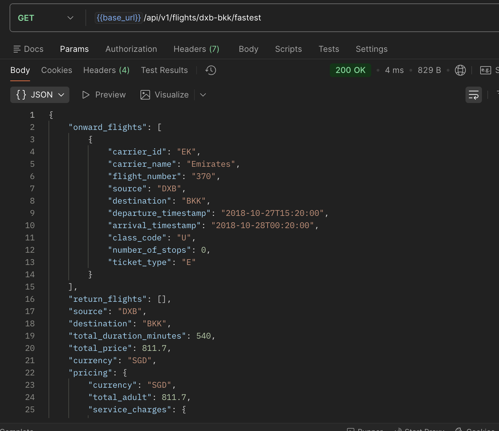
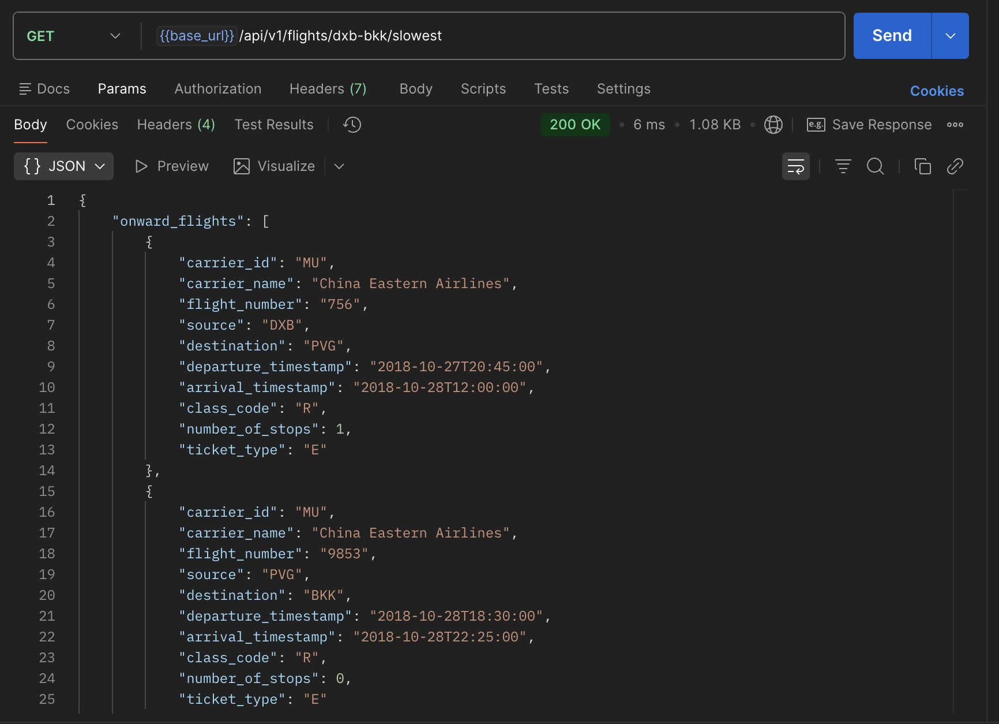
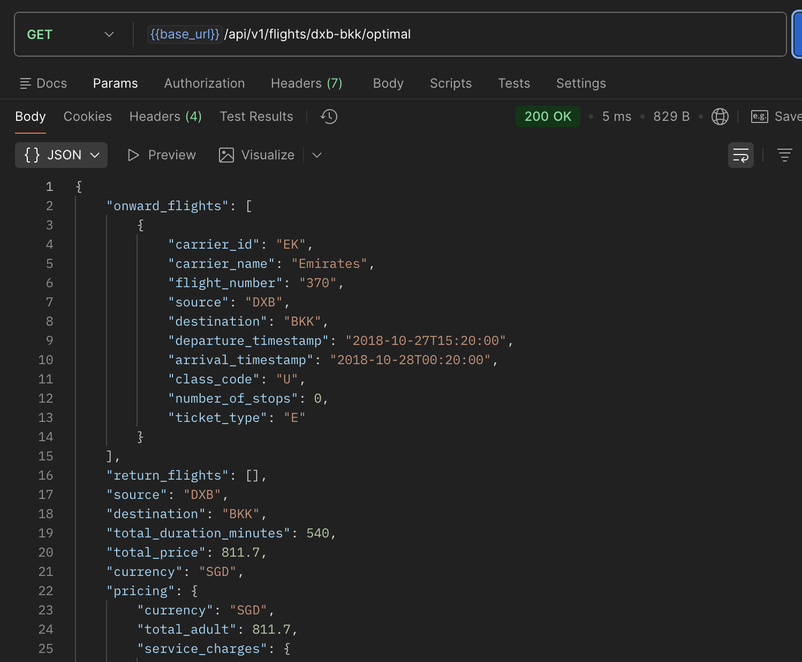
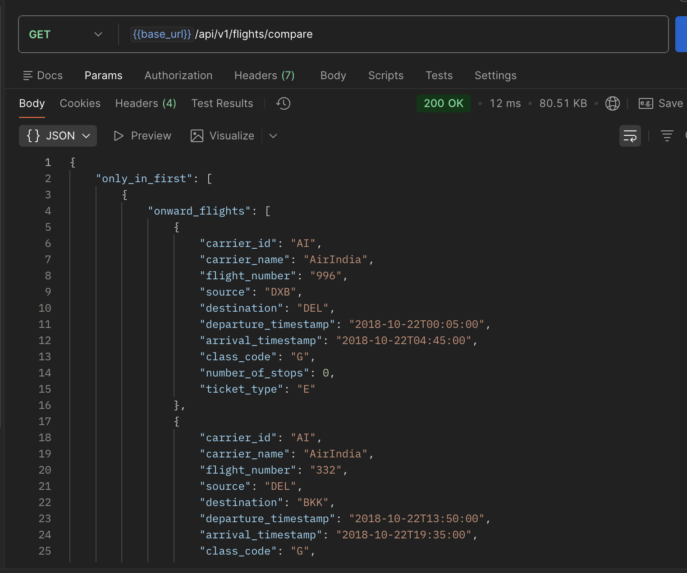

# Скриншоты работающего приложения

## 1. Swagger UI - Документация API

Интерактивная документация API доступна по адресу `http://127.0.0.1:8000/docs`. Здесь можно:
- Просмотреть все доступные эндпоинты
- Протестировать API прямо в браузере
- Увидеть схемы запросов и ответов
- Посмотреть примеры данных

## 2. Получение всех вариантов перелёта DXB-BKK



Эндпоинт возвращает список всех доступных вариантов перелёта из Дубая (DXB) в Бангкок (BKK).

**Запрос:**
```bash
GET http://127.0.0.1:8000/api/v1/flights/dxb-bkk
```

**Что видно на скриншоте:**
- Список всех вариантов перелёта
- Информация о каждом рейсе (авиакомпания, номер рейса, время)
- Цена и валюта для каждого варианта
- Длительность перелёта в минутах
- Детальная информация о ценообразовании

---

## 3. Самый дешёвый вариант перелёта



Эндпоинт находит вариант перелёта с минимальной стоимостью.

**Запрос:**
```bash
GET http://127.0.0.1:8000/api/v1/flights/dxb-bkk/cheapest
```

**Что видно на скриншоте:**
- Один вариант перелёта с минимальной ценой
- Детальная информация о рейсах (onward_flights)
- Общая цена перелёта
- Валюта цены
- Длительность перелёта

**Ответ:**
```json
{
  "onward_flights": [...],
  "return_flights": [],
  "source": "DXB",
  "destination": "BKK",
  "total_duration_minutes": 495,
  "total_price": 450.50,
  "currency": "USD",
  "pricing": {...}
}
```

---

## 4. Самый дорогой вариант перелёта



Эндпоинт находит вариант перелёта с максимальной стоимостью.

**Запрос:**
```bash
GET http://127.0.0.1:8000/api/v1/flights/dxb-bkk/most-expensive
```

**Что видно на скриншоте:**
- Вариант перелёта с максимальной ценой
- Информация о всех рейсах в маршруте
- Высокая стоимость перелёта
- Детальная разбивка ценообразования

---

## 5. Самый быстрый вариант перелёта



Эндпоинт находит вариант перелёта с минимальной длительностью.

**Запрос:**
```bash
GET http://127.0.0.1:8000/api/v1/flights/dxb-bkk/fastest
```

**Что видно на скриншоте:**
- Вариант перелёта с минимальным временем в пути
- Общая длительность перелёта в минутах
- Информация о времени отправления и прибытия
- Цена самого быстрого варианта

---

## 6. Самый долгий вариант перелёта



Эндпоинт находит вариант перелёта с максимальной длительностью.

**Запрос:**
```bash
GET http://127.0.0.1:8000/api/v1/flights/dxb-bkk/slowest
```

**Что видно на скриншоте:**
- Вариант перелёта с максимальным временем в пути
- Возможно, включает пересадки или более длинные маршруты
- Общая длительность перелёта
- Стоимость долгого варианта

---

## 7. Оптимальный вариант перелёта



Эндпоинт находит оптимальный вариант перелёта, учитывающий баланс между ценой и временем.

**Запрос:**
```bash
GET http://127.0.0.1:8000/api/v1/flights/dxb-bkk/optimal
```

**Что видно на скриншоте:**
- Вариант перелёта с наилучшим балансом цены и длительности
- Алгоритм выбирает перелёт, который не самый дорогой, но и не самый долгий
- Оптимальное соотношение цена/время

---

## 8. Сравнение результатов двух запросов



Эндпоинт сравнивает результаты двух XML запросов и показывает различия.

**Запрос:**
```bash
GET http://127.0.0.1:8000/api/v1/flights/compare
```

**Что видно на скриншоте:**
- Перелёты, присутствующие только в первом запросе (only_in_first)
- Перелёты, присутствующие только во втором запросе (only_in_second)
- Перелёты с изменёнными ценами (price_changes)
- Общее количество перелётов в каждом запросе

**Ответ:**
```json
{
  "only_in_first": [...],
  "only_in_second": [...],
  "price_changes": [
    {
      "itinerary": {...},
      "price_changed": {
        "old": 450.50,
        "new": 480.00
      }
    }
  ],
  "total_first": 200,
  "total_second": 172
}
```

---

## Проверка работы

### Запуск приложения

```bash
cd aviasales
source venv/bin/activate
uvicorn cmd.server.main:app --host 127.0.0.1 --port 8000 --reload
```

### Тестирование API

```bash
# Получение всех вариантов перелёта
curl http://127.0.0.1:8000/api/v1/flights/dxb-bkk

# Самый дешёвый вариант
curl http://127.0.0.1:8000/api/v1/flights/dxb-bkk/cheapest

# Самый дорогой вариант
curl http://127.0.0.1:8000/api/v1/flights/dxb-bkk/most-expensive

# Самый быстрый вариант
curl http://127.0.0.1:8000/api/v1/flights/dxb-bkk/fastest

# Самый долгий вариант
curl http://127.0.0.1:8000/api/v1/flights/dxb-bkk/slowest

# Оптимальный вариант
curl http://127.0.0.1:8000/api/v1/flights/dxb-bkk/optimal

# Сравнение результатов
curl http://127.0.0.1:8000/api/v1/flights/compare

# Health check
curl http://127.0.0.1:8000/api/v1/health
```

### Открытие документации

- **Swagger UI**: http://127.0.0.1:8000/docs
- **ReDoc**: http://127.0.0.1:8000/redoc
- **OpenAPI схема**: http://127.0.0.1:8000/openapi.json

## Проверка функциональности

Откройте приложение и проверьте, что:
- ✅ Swagger UI доступен и отображает все эндпоинты
- ✅ Все варианты перелёта возвращаются корректно
- ✅ Фильтрация по цене работает (cheapest, most-expensive)
- ✅ Фильтрация по времени работает (fastest, slowest)
- ✅ Оптимальный вариант выбирается правильно
- ✅ Сравнение результатов работает корректно
- ✅ Health check возвращает статус сервиса

## Postman коллекция

Для удобного тестирования API создана коллекция Postman:
- Файл: `Aviasales_API.postman_collection.json`
- Включает все эндпоинты API
- Организована по категориям: Health, Flights, Comparison

## Тестирование

```bash
pytest
```

Все тесты проходят успешно.

## Статус приложения

✅ Все эндпоинты работают корректно  
✅ Swagger документация доступна  
✅ Фильтрация перелётов функционирует  
✅ Сравнение результатов работает  
✅ Тесты проходят успешно  
✅ Postman коллекция готова к использованию
