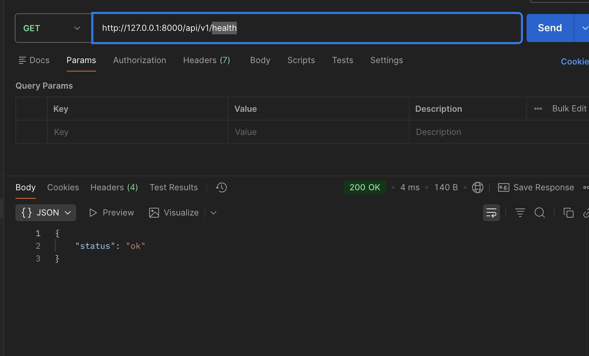
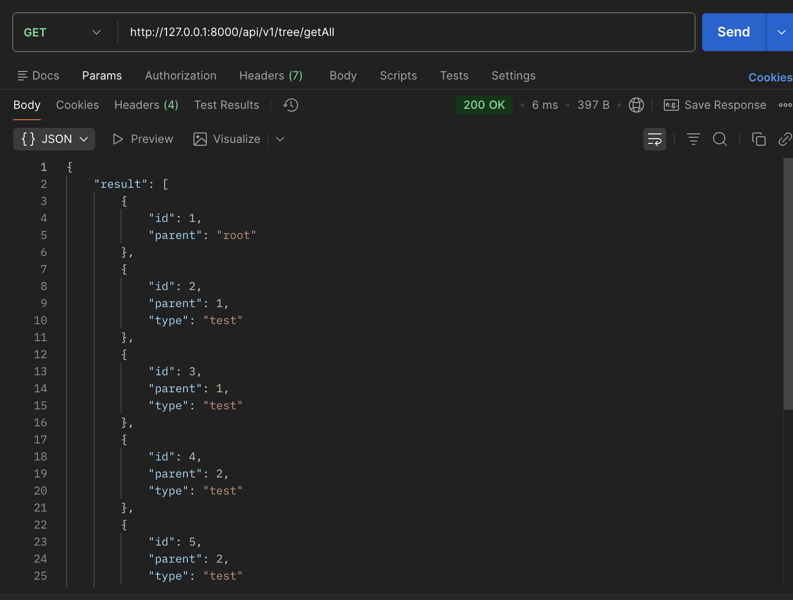
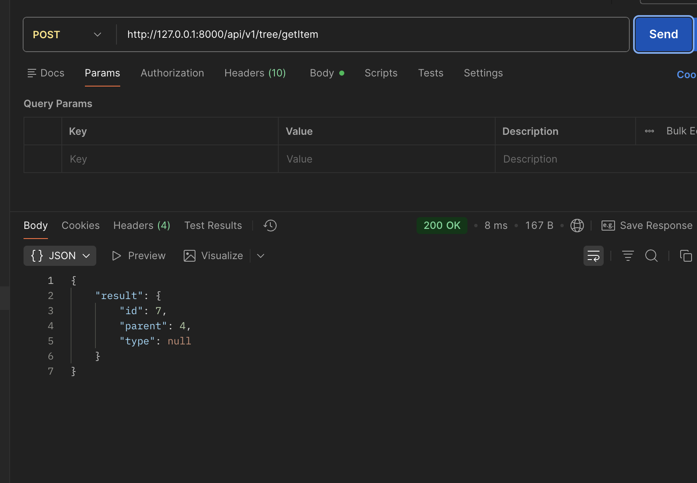
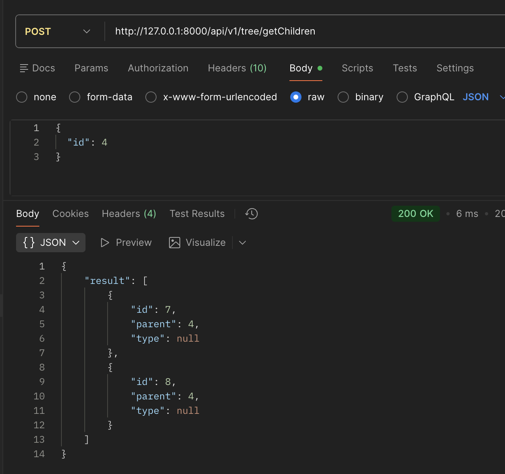
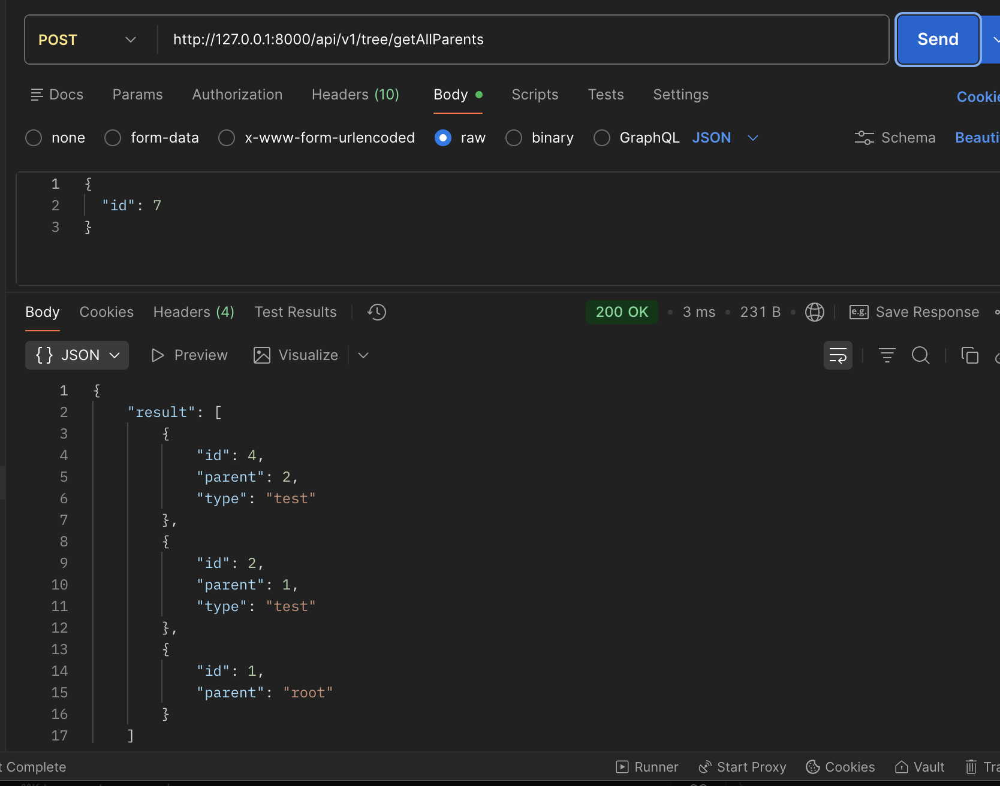
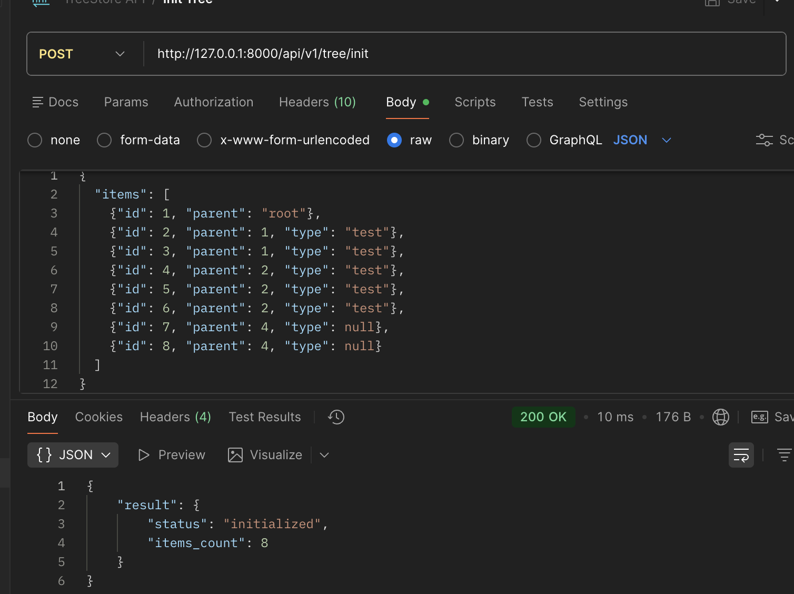

# Скриншоты работающего приложения

## 1. Health Check



Проверка работоспособности API.

**Запрос:**
```bash
GET http://127.0.0.1:8000/api/v1/health
```

**Ответ:**
```json
{
  "status": "ok"
}
```

**Что видно на скриншоте:**
- Запрос выполнен успешно (Status 200 OK)
- API отвечает корректно

---

## 2. Get All



Получение всех элементов дерева.

**Запрос:**
```bash
GET http://127.0.0.1:8000/api/v1/tree/getAll
```

**Что видно на скриншоте:**
- Запрос выполнен успешно
- Возвращены все 8 элементов дерева
- Структура данных корректна

---

## 3. Get Item



Получение элемента по id.

**Запрос:**
```bash
POST http://127.0.0.1:8000/api/v1/tree/getItem
Body: {"id": 7}
```

**Ответ:**
```json
{
  "result": {
    "id": 7,
    "parent": 4,
    "type": null
  }
}
```

**Что видно на скриншоте:**
- Запрос выполнен успешно
- Возвращен элемент с id=7
- Данные корректны

---

## 4. Get Children



Получение дочерних элементов.

**Запрос:**
```bash
POST http://127.0.0.1:8000/api/v1/tree/getChildren
Body: {"id": 4}
```

**Ответ:**
```json
{
  "result": [
    {"id": 7, "parent": 4, "type": null},
    {"id": 8, "parent": 4, "type": null}
  ]
}
```

**Что видно на скриншоте:**
- Запрос выполнен успешно
- Возвращены дочерние элементы для id=4
- Найдено 2 дочерних элемента

---

## 5. Get All Parents



Получение цепочки родителей.

**Запрос:**
```bash
POST http://127.0.0.1:8000/api/v1/tree/getAllParents
Body: {"id": 7}
```

**Ответ:**
```json
{
  "result": [
    {"id": 4, "parent": 2, "type": "test"},
    {"id": 2, "parent": 1, "type": "test"},
    {"id": 1, "parent": "root"}
  ]
}
```

**Что видно на скриншоте:**
- Запрос выполнен успешно
- Возвращена цепочка родителей от элемента 7 до корня
- Порядок элементов правильный (от ближайшего родителя к корню)

---

## 6. Init Tree



Инициализация дерева с новыми данными.

**Запрос:**
```bash
POST http://127.0.0.1:8000/api/v1/tree/init
Body: {
  "items": [...]
}
```

**Что видно на скриншоте:**
- Запрос выполнен успешно
- Дерево инициализировано
- Возвращен статус и количество элементов

---

## Проверка работы

### Запуск сервера

```bash
cd "ООО мстрой"
source venv/bin/activate
uvicorn cmd.server.main:app --host 127.0.0.1 --port 8000
```

### Тестирование API

```bash
# Health check
curl http://127.0.0.1:8000/api/v1/health

# Get all
curl http://127.0.0.1:8000/api/v1/tree/getAll

# Get item
curl -X POST http://127.0.0.1:8000/api/v1/tree/getItem \
  -H "Content-Type: application/json" \
  -d '{"id": 7}'

# Get children
curl -X POST http://127.0.0.1:8000/api/v1/tree/getChildren \
  -H "Content-Type: application/json" \
  -d '{"id": 4}'

# Get all parents
curl -X POST http://127.0.0.1:8000/api/v1/tree/getAllParents \
  -H "Content-Type: application/json" \
  -d '{"id": 7}'
```

### Открытие Swagger UI

```
http://127.0.0.1:8000/docs
```

## Проверка функциональности

Откройте приложение и проверьте, что:
- ✅ getAll() возвращает все элементы
- ✅ getItem(id) возвращает элемент по id
- ✅ getChildren(id) возвращает дочерние элементы
- ✅ getAllParents(id) возвращает цепочку родителей
- ✅ Все операции выполняются быстро (O(1) или O(h))
- ✅ API работает корректно через Postman

## Тестирование

```bash
pytest
```

Все тесты проходят успешно. Покрытие кода: 88%.
